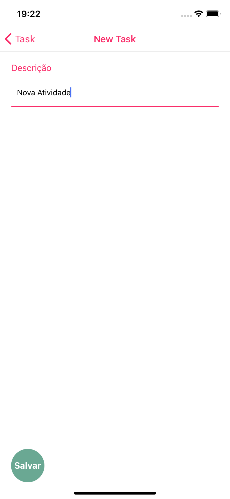
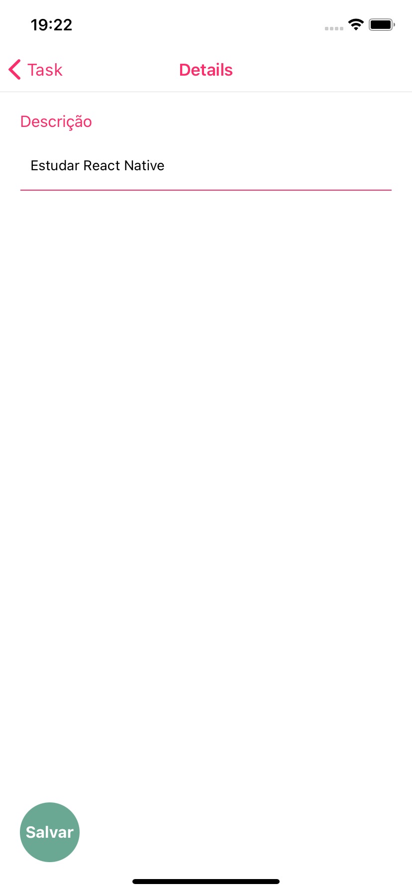

# AppTask
<h2>About:</h2>
<h3>A simple task app that has a complete CRUD developed in React-Native integrated with Firebase</h3>
<h3>Technologies:</h3>
<ul>
<li><a href="https://reactnative.dev/docs/getting-started">React Native 0.68</a></li>
<li><a href="https://reactnavigation.org/docs/getting-started/">React Navigation</a></li>
<li><a href="https://firebase.google.com/?hl=pt">Google Firebase</a></li>
</ul>
<h2 id="motivation">Screenshots:</h2>
<ul>
<li>Image 1 (Task: displays all saved tasks, with the possibility to delete them.)
<li>Image 2 (New Task: add a new task)
<li>Image 3 (Details: displays the task details, with the possibility to update.)
</ul>
 
 

In development...🚧

